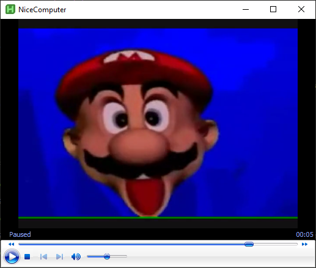

# nice-computer

<br />
<p align="center">
  
</p>

<p align="center">
  <a href="https://github.com/ashnel3/nice-computer/releases/latest/download/NiceComputer.7z">Download</a> &bull;
  <a href="#About">About</a> &bull;
  <a href="#Usage">Usage</a>
</p>


## About:

Simple [Autohotkey v2](https://www.autohotkey.com/) implementation of "[ooh, nice computer you got here: can i have it](https://youtu.be/aAtF-Zzdnc8)" by [ControlleronaHanger](https://www.youtube.com/@controlleronahanger).

Uses [0:30 - 0:36](https://youtu.be/9tQWLg4E90M?t=30) from "[Mario Head Collection](https://youtu.be/9tQWLg4E90M)" by [marioheadmania](https://www.youtube.com/@marioheadmania).

## Usage:

```bash
# Waits 0 - 60s after mouse input
NiceComputer.exe

# Runs whatever command is passed to it
NiceComputer.exe echo "Hello!"     # -> Hello!

# Use the shutdown command to replicate the video
NiceComputer.exe shutdown -s       # -> Shutdown
```
